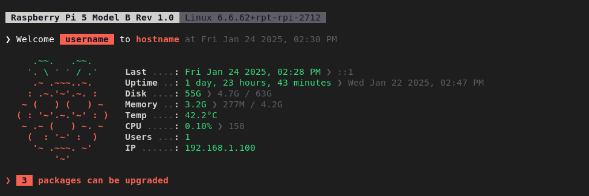

# Raspberry Pi MOTD

This repository contains scripts and configurations to update the Message of the Day (MOTD) on a Raspberry Pi.

## Table of Contents
- [Installation](#installation)
- [Structure](#structure)
- [Configuration](#configuration)
- [Applying Configuration](#applying-configuration)
- [License](#license)

## Screenshots


## Installation

To install the update-motd scripts on your Raspberry Pi, follow these steps:

1. Clone the repository:
    ```sh
    git clone https://github.com/ozmeta/motd-raspberrypi.git
    cd motd-raspberrypi
    ```

2. Run the installation script:
    ```sh
    sudo bash install.sh
    ```

## Structure

The installed structure is organized as follows:

```bash
/
├── usr
│   └── bin
│       └── update-motd
├── etc
│   ├── motd-config
│   ├── update-motd.d
│   │   ├── 00-header
│   │   ├── 10-welcome
│   │   ├── 20-system
│   │   └── 30-upgrade
│   └── motd-compiled
```

### Description of Key Files & Directories:

- **`usr/bin/update-motd`**: The primary executable used to apply configuration changes to the Message of the Day (MOTD).
- **`etc/motd-config`**: Configuration file where global settings for the MOTD system are defined.
- **`etc/update-motd.d/`**: Directory containing individual scripts that contribute to different sections of the MOTD:
    - **`00-header`**: Displays the header of the MOTD.
    - **`10-welcome`**: Displays a welcome message.
    - **`20-system`**: Displays system information.
    - **`30-upgrade`**: Shows upgrade information.
- **`etc/motd-compiled`**: This file is automatically generated after each compile, containing the detailed format of `/etc/motd-config` to be used in the MOTD.

## Configuration

After installation, you can configure the MOTD by editing the configuration files located in the `/etc/motd-config` directory.

1. Open the configuration file:
    ```sh
    sudo nano /etc/motd-config
    ```

2. Modify the content as needed:
    - **`DATE_FORMAT`**: Set the date format.
        - 12-Hour: `%a %b %d %Y, %I:%M %p`
        - 24-Hour: `%a %b %d %Y, %H:%M`
    - **`ASCII_ART`**: Display ASCII art (set to `true`, `yes`, or `1`).
    - **`PACKAGE_MANAGER`**: Specify the package manager of the system (e.g., `apt`, `dnf`, `zypper`, `pacman`).
    - **`BULLET`**: Set a custom bullet point character (e.g., `❯`, `*`, `-`).
    - **`COLON`**: Set a custom colon character (e.g., `:`, `.`, etc.).
    - **`STYLES`**: Define the main styles used throughout the MOTD. Each style can combine color and text attributes:
        - `PRIMARY_STYLE`: The primary style (e.g., `red`, `bold`, `red;bold`).
        - `SECONDARY_STYLE`: The secondary style (e.g., `light_blue`, `italic`, `light_blue;italic`).
        - `TITLE_STYLE`: The style for titles (e.g., `gray`, `underline`, `gray;underline`).
        - `SUBTITLE_STYLE`: The style for subtitles (e.g., `light_black`, `bold`, `light_black;bold`).

3. Compile the configuration to apply your settings. See [Applying Configuration](#applying-configuration) for more details.

## Applying Configuration

To apply the new configuration, you need to compile the MOTD:

1. Run the compiler script that is installed to `/usr/bin/update-motd`:
    ```sh
    sudo update-motd
    ```

This will generate a new compiled configuration in `/etc/motd-compiled`, which will be used in the MOTD.

## License

This project is licensed under the MIT License. See the [LICENSE](LICENSE) file for more details.
